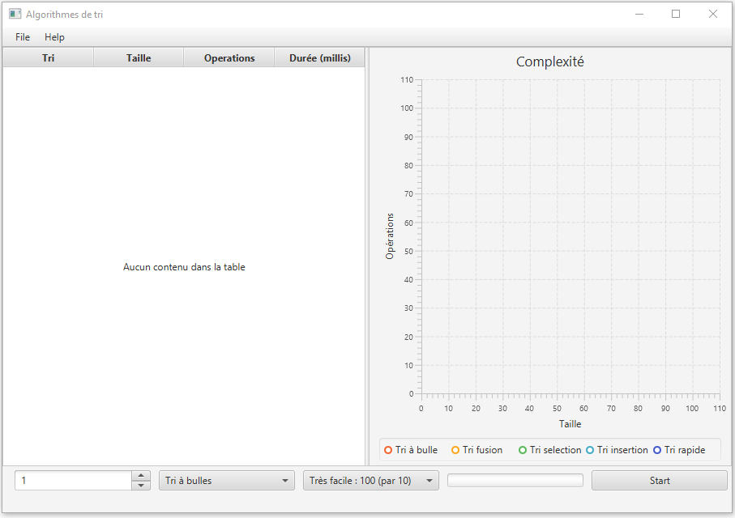
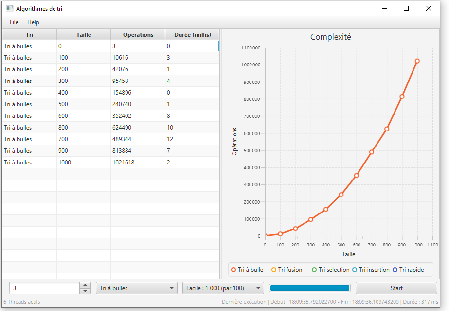

# SortingRace: Multi-Threaded Sorting Application

## Project Overview

SortingRace is a JavaFX application designed to demonstrate and compare the performance of sorting algorithms (Bubble Sort and Merge Sort) on multiple datasets. It allows users to configure the number of threads available for processing and observe the number of operations executed during the sorting process. The application employs MVC (Model-View-Controller) architecture and leverages JavaFX for its graphical user interface (GUI).

## Key Features

- Thread Configuration: Users can specify the number of threads to use for sorting. By default, the application runs with one thread.
- Sorting Algorithms: Supports two types of sorting algorithms:
  - Bubble Sort: A simple comparison-based sorting algorithm with a quadratic time complexity.
  - Merge Sort: A more efficient divide-and-conquer sorting algorithm with a time complexity of O(n log n).
- Dataset Size Selection: Users can choose the size of the datasets to be sorted, ranging from "Very Easy" (100 integers) to larger datasets.
- Real-Time Feedback: As the sorting progresses, the number of operations is tracked and displayed in real-time.

## How To Run It

1. **Prerequisites:** Ensure you have JavaFX and Maven installed on your system.
2. **Clone the project repository**
3. Run the Application with IntelIJ:
    - From the Maven panel, go to the JavaFX section and double-click on javafx:run.
    - The application should open with the graphical interface, allowing you to search for routes between metro stations.

## Screenshots

